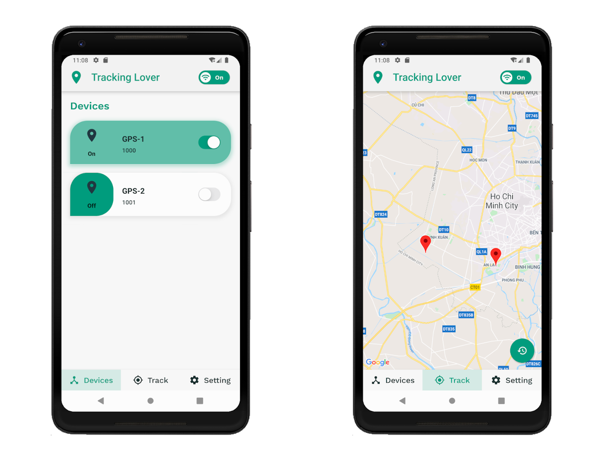

# IoT Tracking

> Cross-platform mobile app for tracking GPS with IoT technologies.

## Table of Contents

1.  [Introduction](#introduction)
2.  [Requirements](#requirements)
3.  [Installation](#installation)
4.  [Build & Run](#build--run)
5.  [Known Issues](#known-issues)
6.  [Contributors](#contributors)

## Introduction



This app allow user to track their GPS device(s) & visualize it on Google's map.

It uses some IoT technologies such as _IoT Gateway_, _MQTT protocol_ & most importantly, it built on top of **Flutter**, so it's platform-free.

> <u>_Note:_</u> This application is still in-development stage with simualated data, but you can still download and experiment with it, instructions below.

## Requirements

-   [**Flutter**](https://flutter.dev/docs/get-started/install) (>=1.16).
-   [**NodeJS**](https://nodejs.org/en/download/) with [**Yarn**](https://classic.yarnpkg.com/en/docs/install) installed.
-   [**MongoDB**](https://docs.mongodb.com/manual/installation/).

## Installation

1.  Clone this repo:
    ```shell
    $ git clone https://github.com/thuyhoang-bkuer/IoT-tracking.git
    ```
2.  In `root` directory, install Flutter's packages by running the following command:
    ```shell
    $ flutter packages get
    ```
3.  In `server` directory, install Node's packages by running the following command:
    ```shell
    $ yarn install
    ```
4.  _(Optional)_ If you don't have appropriate GPS devices, you can use our simulated data: in `broker` directory, install Node's packages:
    ```shell
    $ yarn install
    ```

## Build & Run

1.  Make sure your MongoDB's service is running on your computer. Then run the server by running the following command in `root` directory:
    ```shell
    $ yarn start
    ```
2.  Start MQTT's Broker by running the following command in `broker` directory:
    ```shell
    $ yarn start
    ```
3.  _(Optional)_ If you want to test our simulated data, you can run this command in `broker` directory:
    ```shell
    $ node client.js
    ```
4.  Make sure you're having a Mobile Emulator running. And finally, build & run Flutter app by running this command in `root` directory:
    ```shell
    $ flutter run
    ```

## Known Issues

> Feel free to raise any issue when you have trouble with the app.

## Contributors

|                                                                                                                               Info                                                                                                                                |  Role  | Work                                                                       |
| :---------------------------------------------------------------------------------------------------------------------------------------------------------------------------------------------------------------------------------------------------------------: | :----: | -------------------------------------------------------------------------- |
| <div style="width: 200px"><a href="https://github.com/vuong-cuong-phoenix"> <br/> Vuong Chi Cuong </a></div> | Leader | Project manager, UI/UX design, architecture design, report, documentation. |
|                      <div style="width: 200px"><a href="https://github.com/thuyhoang-bkuer"> <br/> Hoang Vu Trong Thuy </a></div>                       |  Core  | Major UI/UX implementation, core funtionality, simulate IoT enviroment.    |
|                              <div style="width: 200px"><a href="https://github.com/WeOneTeam"> <br/> Bui Ba Anh </a></div>                              |  Core  | Minor UI/UX implementation, Authentication service.                        |
|                         <div style="width: 200px"><a href="https://github.com/ductuantruong"> <br/> Truong Duc Tuan </a></div>                          |  Core  | Database design & implementation, REST API.                                |
|                           <div style="width: 200px"><a href="https://github.com/VinhLe-Zero1"> <br/> Le Trung Vinh </a></div>                           |  Core  | Database design & implementation.                                          |
